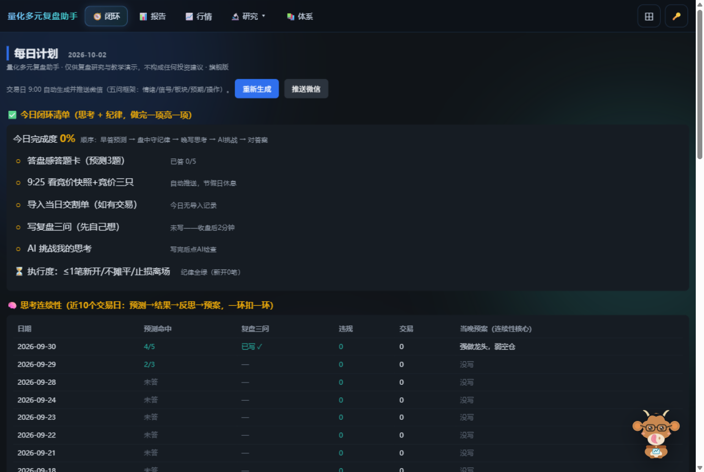
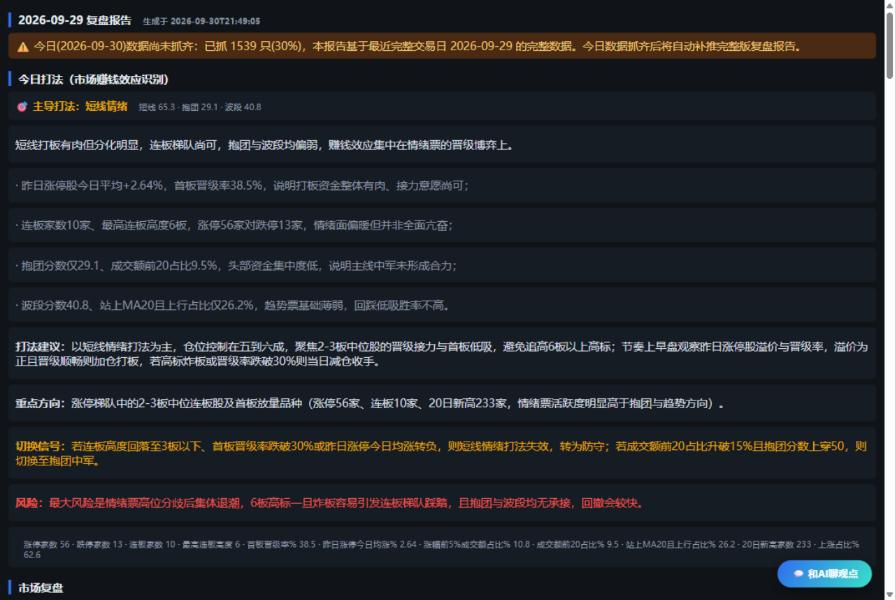
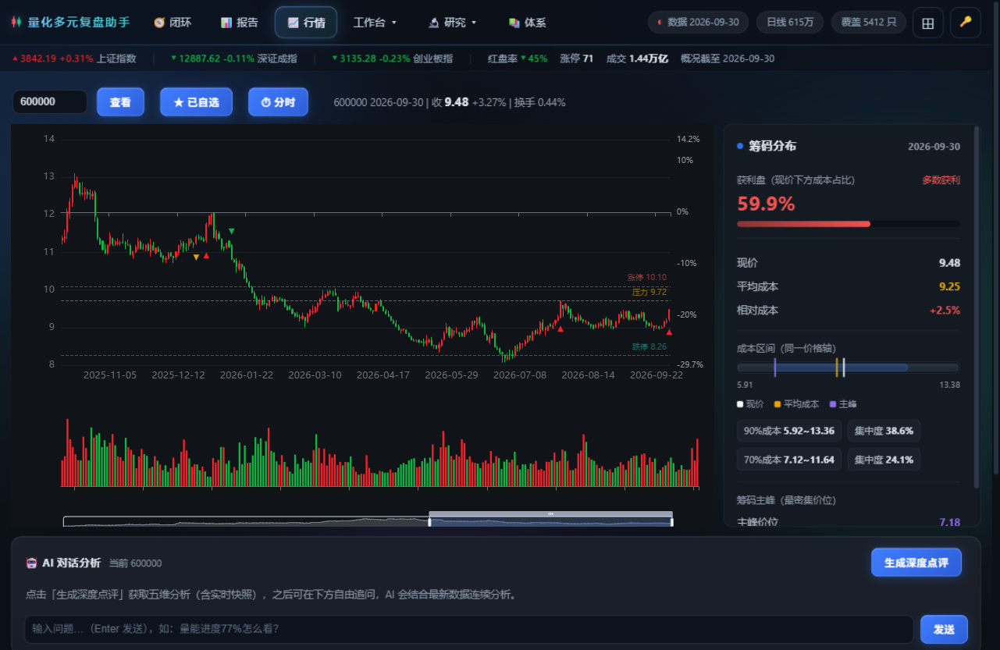
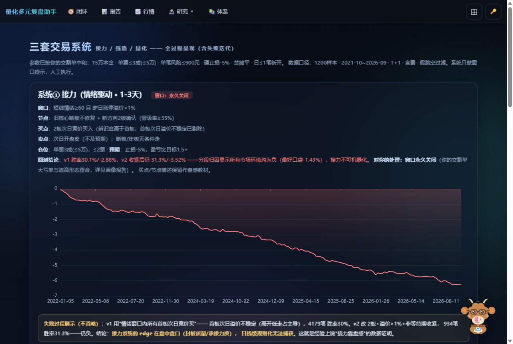
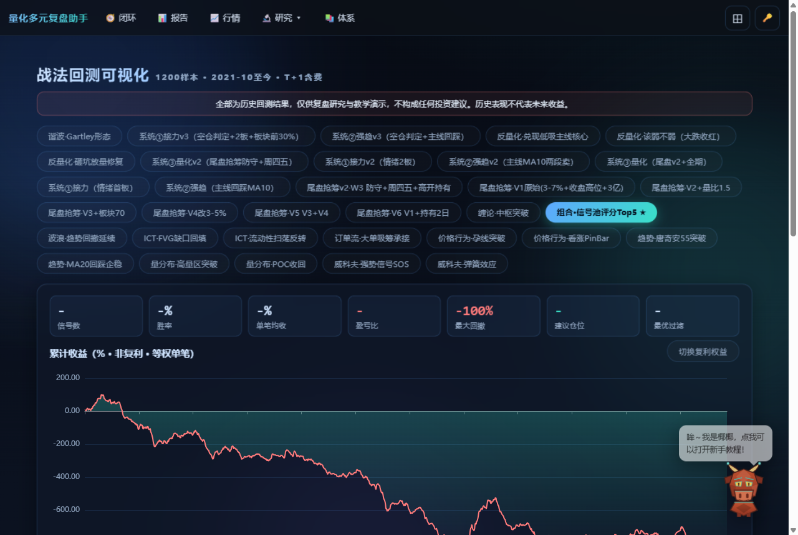

# 📈 研几量化平台

> 盘中实时行情 · 每日复盘报告 · 盘感训练闭环 · 交易纪律审计
> **让每一次复盘都留下思考的痕迹**

本工具仅供复盘研究与教学演示，不构成任何投资建议；股市有风险，据此操作后果自负。

---

## 这是什么

一套跑在你自己电脑上的 **A股量化复盘工作台**：交易日全自动运行——早上推送盘前计划与盘感答题卡，盘中提供实时分时与资金关注榜，收盘后生成复盘报告并审计你的交易纪律，晚上用 AI 拿真实数据挑战你写的复盘思考。

**不是选股软件，是复盘训练系统。** 它最大的价值是替你证伪，而不是替你选股。

## 每日闭环（核心工作流）

| 时间 | 动作 | 谁动脑 |
|---|---|---|
| 9:00 | 盘前计划 + **盘感答题卡**（最高板晋级/板块持续性/弱转强/量能对策） | 你 |
| 9:25 | 竞价快照 + **竞价三只**（高资金关注×板块前列，承接强度排序） | 系统 |
| 盘中 | 行情页 K 线 + **当日分时**（30秒刷新）+ 资金关注榜 | 你 |
| 14:45 | 尾盘探测（AI 全量预审，含放弃原因） | 系统 |
| 16:40 | 复盘报告 + **执行度审计**（违规红字点名）+ 答题卡判分 | 系统 |
| 收盘后 | **复盘三问**（先自己写）→ AI 拿当日数据逐条质问 → 你答辩 → AI 判卷 | 你先、AI后 |

## 功能一览

### 📊 每日复盘报告
涨跌家数、量能结构、涨停梯队、板块强弱、题材生命线、主力意图高分榜——外加 **AI 市场复盘**（现象→机制→操作含义的三层写作框架）。数据自检门控：数据没抓齐宁可延迟推送，也不给你错数字。

### 📈 行情工作台
全市场 K 线 + 筹码分布 + 五维评分 + **当日分时图**（价格线/均价线/成交量，交易时段 30 秒自动刷新），自选池与买点规则触发。

### ⚔️ 战法库与交易系统
12 种战法（威科夫/缠论/ICT/波浪/谐波…）× 5 年回测台账，含失败记录的诚实呈现；三套交易系统（接力/强趋/量化）全过程展示——**回测为负的战法直接标注，不藏**。

### 🧠 盘感训练闭环
预测 → 作答 → 收盘对答案 → 分类命中率。30 天后你会看到一张"直觉在哪类问题上准、在哪类系统性偏"的表——盘感第一次变成可测量的东西。

### 🛡 执行度审计
硬止损、禁摊平、日 ≤1 笔新开、浮盈回吐——四条规则每天自动重放你的交割单，违规在报告顶部**红字点名**。赚钱的第一步不是找到会涨的票，是把失血止住。

### 🐮 椰椰助手
可拖动的桌面小牛（秦川·赤焰），内嵌新手教程、功能索引、今日任务，随叫随到。

## 版本与定价（月/季/年）

| 版本 | 功能 | 价格 |
|---|---|---|
| **基础版** | 全市场数据 / 复盘报告 / 盘前计划 / 每日三只（教学）/ 回测台 | ¥99 / ¥269 / ¥899 |
| **进阶版** | + 主力资金评分 / 题材生命线 / 竞价快照+竞价三只 / 尾盘探测 | ¥199 / ¥549 / ¥1899 |
| **旗舰版** | + AI 深度点评 / 盘后对照 / 情绪分析 / 战法挖掘 / 因子工具 | ¥299 / ¥829 / ¥2899 |

- 首次安装 **14 天全功能免费试用**（含进阶/旗舰），无需任何钥匙
- 一键安装（自动装 Python 环境），数据本地存储，不上传任何个人数据
- 激活码与电脑绑定，换机重发即可；续费/升级数据不丢失

## 技术特点

- 本地运行（127.0.0.1），数据 DuckDB 本地存储，**不依赖云、不上传持仓**
- 交易日历守卫：节假日全任务自动休眠；数据自测 16:15/21:30 两班，异常微信告警
- 推送双通道（Server酱/PushPlus）+ 每日晨检自愈
- 微信推送每日节奏：9:00 盘前 / 9:25 竞价 / 14:45 尾盘 / 16:40 报告

---

## 联系与试用

想试用或购买：联系卖家获取安装包（含保姆级图文说明书，八岁小朋友都能照着装）。

**免责声明**：本工具仅供复盘研究与教学演示，不构成任何投资建议。股市有风险，据此操作后果自负。历史回测表现不代表未来收益。
